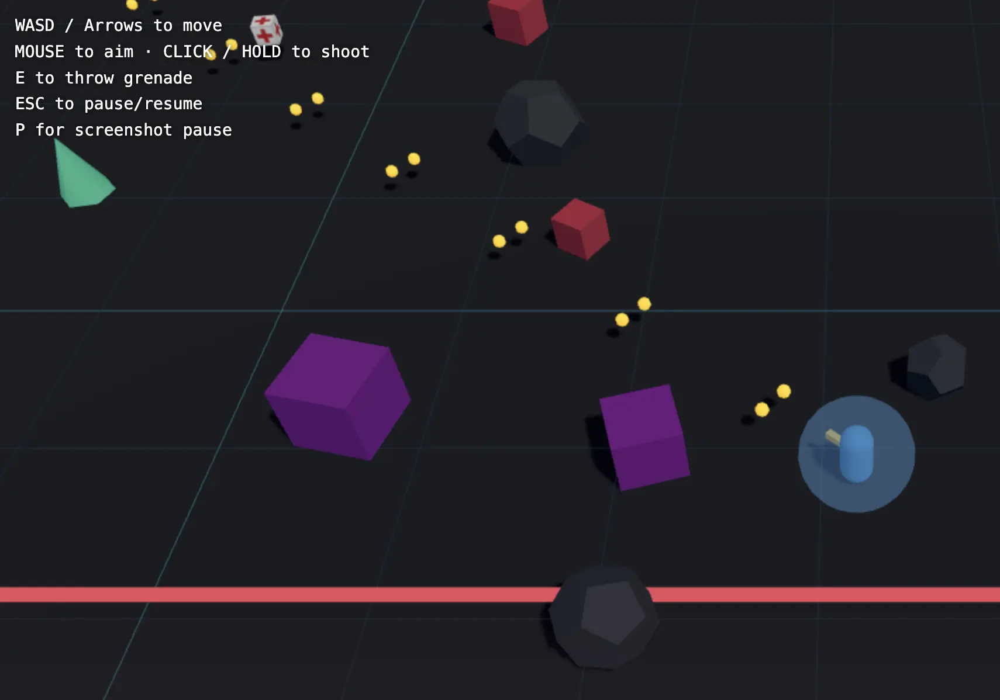
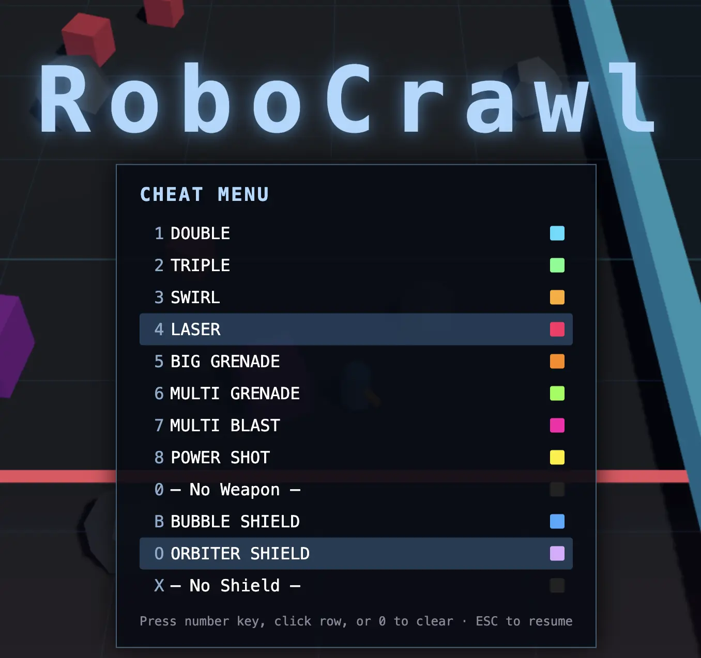

# RoboCrawl - a morning project

A browser-based, top-down arcade shooter built with [Three.js](https://threejs.org/) and TypeScript. You crawl forward through an endless corridor, dodging obstacles and gunning down whatever comes at you.





## Controls

| Input | Action |
|---|---|
| `WASD` / Arrow keys | Move |
| Mouse | Aim |
| Click / hold | Shoot |
| `E` | Throw grenade |
| `ESC` | Pause / resume (opens cheat menu) |
| `P` | Pause / resume (no menu) |

## Running

```sh
scripts/setup      # one-time setup
scripts/run        # start the Vite dev server
scripts/build      # type-check and produce a production build in dist/
```
